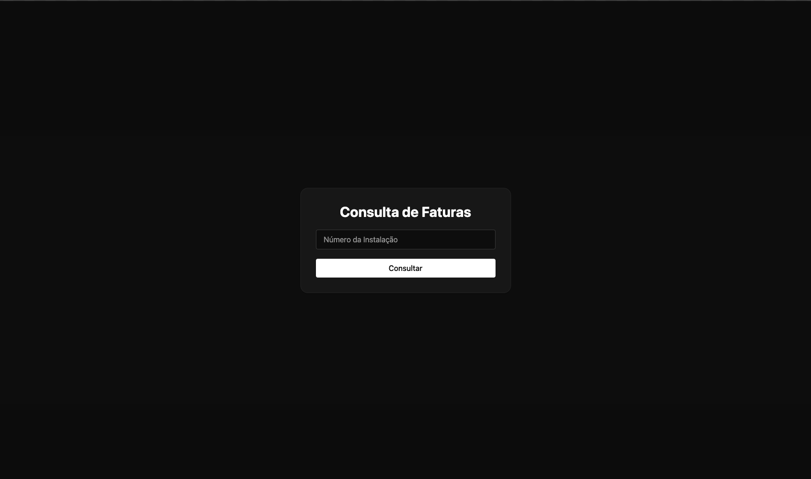
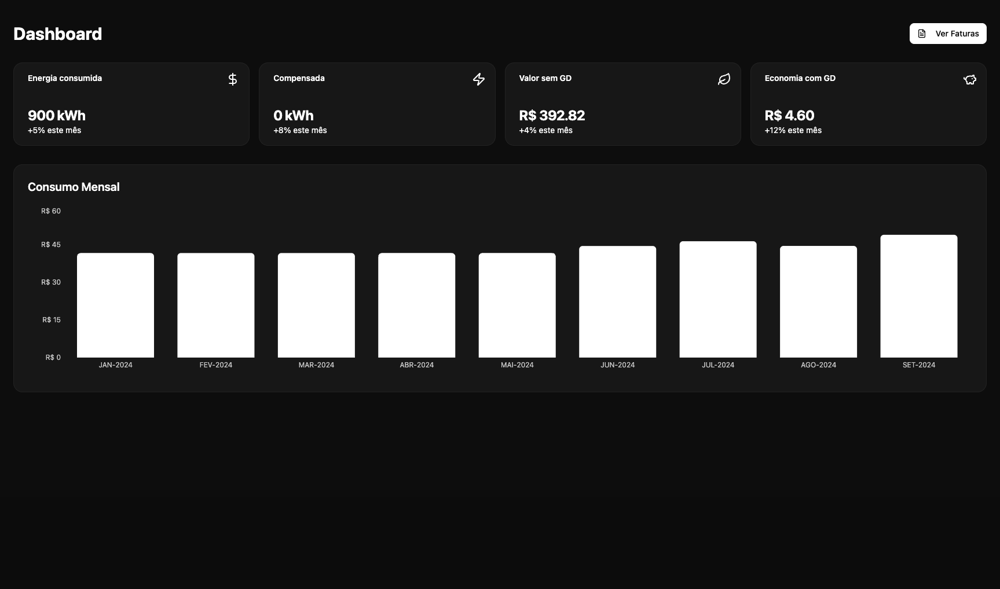
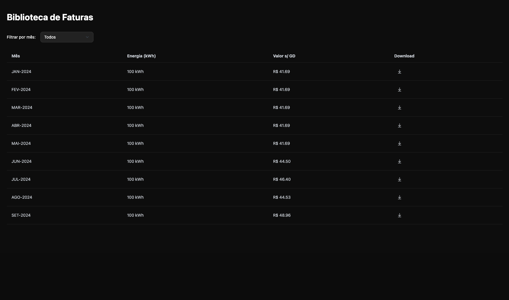

# Lumi Frontend

Interface web para consulta de faturas de energia elétrica e visualização de dados agregados de consumo e economia, baseada em gráficos e tabelas.

✨ **Sobre este Projeto**

Este é o **frontend do projeto Lumi**, uma plataforma que permite que usuários consultem suas faturas de energia elétrica através do número de instalação, visualizando informações como consumo, economia com GD e valores mensais. A interface foi construída com foco em simplicidade, visual escuro moderno e navegação intuitiva.

📦 **Produção (em breve)**: [https://lumi-frontend.vercel.app](https://lumi-frontend.vercel.app)  

## 🧰 Tecnologias

- React + TypeScript  
- Vite  
- Tailwind CSS  
- shadcn/ui  
- Recharts  
- React Router  
- Context API  
- Axios  
- Jest (em configuração)


## 🔹 Como Rodar Localmente

```bash
# Clone o projeto
git clone https://github.com/joaodadas/lumi-frontend.git

# Acesse a pasta
cd lumi-frontend

# Instale as dependências
npm install

# Crie um arquivo .env e configure a base da API
VITE_API_BASE_URL=https://lumi-backend-oj5j.onrender.com

# Inicie o servidor de desenvolvimento
npm run dev
```


## 🌐 Navegação da Aplicação

### 🔐 Login
- Página inicial com campo para digitar o número de instalação.
- Ao submeter, a aplicação verifica se existem faturas para o cliente e redireciona para o Dashboard.

### 📊 Dashboard
- Exibe 4 cards com:
  - Energia consumida (kWh)
  - Energia compensada (kWh)
  - Valor total sem GD (R$)
  - Economia com GD (R$)
- Gráfico de barras com consumo e economia mês a mês.
- Botão para acessar a Biblioteca de Faturas.

### 📚 Biblioteca de Faturas
- Listagem de todas as faturas disponíveis para o cliente autenticado.
- Filtro por mês.
- Botão para download da fatura em PDF.

---

## 📷 Prints da Aplicação

🖼️ **Login Page**  


🖼️ **Dashboard Page**  


🖼️ **Biblioteca de Faturas**  



## 🚀 Melhorias Futuras

- ✅ Melhor tipagem global nos serviços e componentes.
- ✅ Testes completos com `Jest` e `React Testing Library`.
- ✅ Validação com Zod nos inputs e formulários.
- ✅ Acessibilidade (a11y) aprimorada.
- ✅ Animações com framer-motion nos gráficos e interações.

## ✅ Estado Atual do Projeto

- [x] Autenticação por número de instalação  
- [x] Dashboard com 4 cards e gráfico  
- [x] Tela de faturas com filtro por mês e download  
- [x] Visual escuro e responsivo  
- [ ] Deploy da aplicação (em breve)